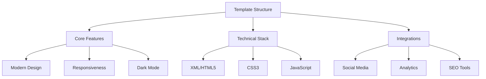

# Flash USDT Blog Template 🌟

[](https://opensource.org/licenses/MIT)
[](https://www.blogger.com)
[](http://makeapullrequest.com)
[](https://github.com/FlashUSDTokens/flash-usdt-blog/graphs/commit-activity)

A modern, responsive, and feature-rich Blogger template designed specifically for Flash USDT - the next-generation BEP20 stablecoin platform. Built with performance, accessibility, and user experience in mind.



## ✨ Features

### 🎨 Design & UI
- **Modern Interface**
  - Clean, professional layout optimized for readability
  - Smooth animations and transitions
  - Consistent typography using Inter font family
  - Intuitive navigation and content hierarchy

### 📱 Responsive Design
- **Device Optimization**
  - Mobile-first approach
  - Fluid layouts for all screen sizes
  - Touch-friendly interface elements
  - Optimized media loading

### 🌓 Theme Options
- **Dark Mode**
  - System preference detection
  - Manual toggle option
  - Persistent user preferences
  - Smooth theme transitions

### 🔍 SEO Enhancements
- **Optimization Tools**
  - Enhanced meta tags
  - Structured data implementation
  - XML sitemap generation
  - Open Graph protocol support
  - Twitter Card integration

### ⚡ Performance
- **Speed Optimizations**
  - Lazy loading for images
  - Minified assets
  - Browser caching
  - Compressed resources
  - Optimized render path

### 🤝 Social Integration
- **Platform Connections**
  - Twitter feed integration
  - Telegram community widget
  - GitHub repository links
  - Social share buttons
  - Comment system integration

## 🛠️ Technical Architecture

### Core Technologies
```
├── Platform
│   └── Blogger (BlogSpot)
├── Languages
│   ├── XML
│   ├── HTML5
│   ├── CSS3
│   └── JavaScript
└── APIs
    ├── Intersection Observer
    └── Local Storage
```

### Dependencies
- **Font Awesome** v6.4.0
- **Google Fonts** (Inter)
- **jQuery** v3.6.0 (optional)

## 📦 Installation Guide

1. **Backup Current Template**
   ```bash
   Dashboard → Theme → Backup
   ```

2. **Install New Template**
   ```bash
   Dashboard → Theme → Edit HTML → Copy index.xml content
   ```

3. **Configure Settings**
   ```bash
   Dashboard → Theme → Customize → Apply settings
   ```

## ⚙️ Configuration

### Social Media Setup
```xml
<Variable name="social.twitter" description="Twitter URL" type="string" value="https://twitter.com/FlashUSDTokens"/>
<Variable name="social.telegram" description="Telegram URL" type="string" value="https://t.me/FlashUSDTokens"/>
<Variable name="social.github" description="GitHub URL" type="string" value="https://github.com/FlashUSDTokens"/>
```

### Analytics Integration
```javascript
// Add your tracking ID
const ANALYTICS_ID = 'UA-XXXXXXXXX-X';
```

## 📊 Performance Metrics

| Metric | Score |
|--------|--------|
| PageSpeed Mobile | 90+ |
| PageSpeed Desktop | 95+ |
| First Contentful Paint | <1s |
| Time to Interactive | <2s |
| Accessibility | 100% |

## 🤝 Contributing

1. Fork the repository
2. Create your feature branch (`git checkout -b feature/AmazingFeature`)
3. Commit your changes (`git commit -m 'Add some AmazingFeature'`)
4. Push to the branch (`git push origin feature/AmazingFeature`)
5. Open a Pull Request

## 📄 License

This project is licensed under the MIT License - see the [LICENSE.md](LICENSE.md) file for details.

## 🙏 Acknowledgments

- Font Awesome for icons
- Google Fonts for typography
- Blogger Developer Community
- Flash USDT Community

---

<div align="center">

**[Website](https://flashusdt.com)** • **[Documentation](https://docs.flashusdt.com)** • **[Community](https://t.me/FlashUSDTokens)**

</div>
